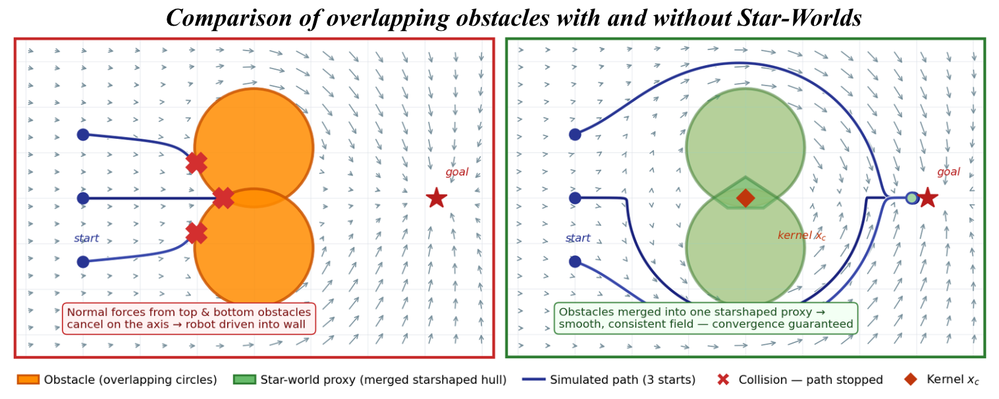
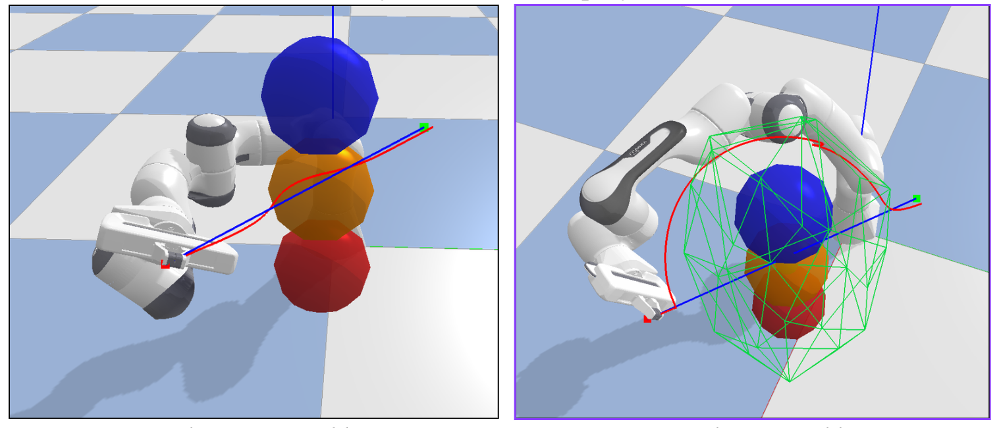
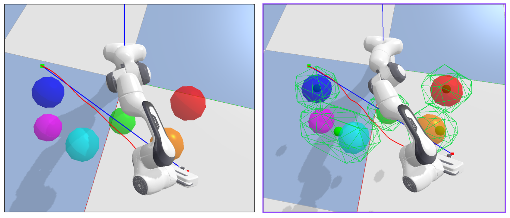

# Star-Worlds: Reactive 3D Motion Planning for a Franka Arm

**MEAM 6230 Final Project — University of Pennsylvania, Spring 2026**  
Gia D'Costa · Saayuj Deshpande · Samhitha Vedire

Implementation of **"Creating Star Worlds: Reshaping the Robot Workspace for Online Motion Planning"** — Dahlin & Karayiannidis, *IEEE Transactions on Robotics* 39(5), 2023. ([DOI](https://doi.org/10.1109/TRO.2023.3279029))

---

## Overview

Reactive motion planners based on modulation (Huber et al.) require obstacles to be **disjoint** and **star-shaped**. In cluttered scenes, overlapping inflated obstacles violate this — their competing repulsion vectors can cancel and trap the robot.

This project extends the Star-Worlds algorithm to **full 3-D end-effector space** for a Franka Panda arm in PyBullet:

1. **Star-World Reshaping (Algorithm 2):** clusters overlapping sphere obstacles into disjoint, strictly starshaped proxy obstacles with a guaranteed kernel point per cluster
2. **Reactive Controller:** Huber-modulation velocity field computed at 40 Hz using the star-world proxy shapes
3. **Null-space arm-body avoidance:** APF repulsion projected into the Jacobian null space keeps arm links clear while the EE tracks its modulated path
4. **PyBullet simulation:** full Franka Panda IK control across six obstacle scenarios

---

## Demo

**▶ [Watch the demo video](https://youtu.be/MY4ZFPl7pGw)**

---

## Results

### 2-D: naive modulation fails vs. star-worlds succeeds

Two overlapping circles form a wall directly on the path. Without star-worlds, the repulsion vectors cancel on the approach axis and all paths collide. With star-worlds, the two circles merge into one proxy with an off-axis kernel — all paths arc around cleanly.



### 3-D: Franka arm navigating with star-world proxies

Green wireframe cages show the actual convex-hull boundary of each star-world proxy. The bright green dot is the kernel center x_{c,i}. The white trail is the EE path.




### Quantitative results (6 PyBullet scenarios)

| Scenario | Raw baseline | Star-Worlds | Notes |
|---|---|---|---|
| `test` | ✓ 1.41× | ✓ 5.10× | SW converges at 60 s limit (near-equilibrium) |
| `overlap` | ✗ | ✓ 6.55× | Raw trapped by cancelling normals; SW merges into one proxy |
| `simple` | ✓ 1.004× | ✓ 1.07× | Two static spheres merge into one proxy |
| `moderate` | ✓ 1.01× | ✓ 1.48× | Dynamic obstacles, some clusters merge |
| `corridor` | ✓ 0.98× | ✗ | Over-merging fills the corridor |
| `wall` | ✗ | ✓ 1.49× | Three-sphere wall merged into single proxy |

**Star-Worlds: 5/6 (83%) · Raw baseline: 4/6 (67%)** · Star-world update: 0.68–8.70 ms (well within 4 Hz budget)

---

## Setup

Requires Python ≥ 3.9.

```bash
git clone https://github.com/saayuj/star-worlds
cd star-worlds
python3 -m venv .venv
source .venv/bin/activate
pip install -r requirements.txt
```

---

## Running the demos

### Franka arm — 3-D PyBullet

```bash
python examples/franka_pybullet_demo.py                           # test scenario (default)
python examples/franka_pybullet_demo.py --scenario simple
python examples/franka_pybullet_demo.py --scenario moderate
python examples/franka_pybullet_demo.py --scenario corridor
python examples/franka_pybullet_demo.py --scenario wall
python examples/franka_pybullet_demo.py --scenario overlap        # star-worlds ON
python examples/franka_pybullet_demo.py --scenario overlap --raw  # naive baseline
```

Press **Enter** in the terminal once the window opens to start the simulation.

**GUI overlays:** green wireframe = star-world proxy hull · green dot = kernel center · orange arrow = EE velocity · white trail = EE path

### 2-D visualisations

```bash
python examples/2d_comparison.py   # naive failure vs. star-worlds — saves 2d_comparison.png
python examples/2d_static.py       # star-world construction for 3 ellipses
python examples/2d_dynamic.py      # animated moving obstacles
```

---

## Tests

```bash
pytest tests/ -v    # 51 tests, ~2 s
```

---

## Repository structure

```
starworlds/
├── obstacles.py          # Ellipse, Ellipsoid obstacle types
├── geometry.py           # 2-D geometry (tangents, cone polygons, clipping)
├── geometry_3d.py        # 3-D geometry (convex hull, tetrahedron kernel)
├── admissible_kernel.py  # Admissible kernel — Eq. (6)–(9)
├── starshaped_hull.py    # Starshaped hull — Eq. (11), 2-D and 3-D
├── kernel_selection.py   # Algorithm 3 — kernel point selection
├── star_world.py         # Algorithm 2 — main pipeline
├── integration.py        # StarWorldUpdater (auto-detects 2-D/3-D)
└── reactive_controller.py # Huber modulation controller
examples/
├── franka_pybullet_demo.py  # Full 3-D Franka + PyBullet demo
├── obstacle_scenarios.py    # Scenario definitions
├── 2d_comparison.py         # Before/after 2-D figure
└── 2d_static.py / 2d_dynamic.py
```

---

## References

- Dahlin & Karayiannidis, "Creating Star Worlds," *IEEE T-RO* 39(5), 2023
- Huber, Billard & Slotine, "Avoidance of Convex and Concave Obstacles," *IEEE RA-L* 4(2), 2019
- Huber, Slotine & Billard, "Avoiding Dense and Dynamic Obstacles," *IEEE T-RO* 38(5), 2022
